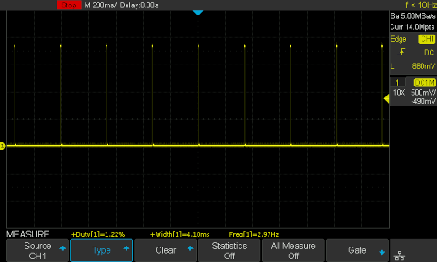
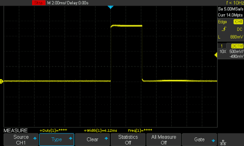

# Description

This example demonstrates use of the LCD within a FreeRTOS application.

In addition to providing display support, the application optionally utilizes
double buffering to eliminate display flicker, and provides several trace and
debug options for measuring execution time of code.

## Display Example

The provided display example utilizes a FreeRTOS task to periodically update the
display at a 3Hz.  The refresh rate can be adjusted through the `FRAME_RATE_MS`
constant in LCD_Task.c.

The display example has two different graphics options
 - FreeRTOS Stats (default) - Displays the run time statistics for running tasks
 - Colorbars - Displays generic colorbar test pattern with a rotating effect.

### Page Flipping / Double Buffering

The display task has an optional (enabled by default) double buffering
capability through the use of page flipping.  Two frame buffers are utilized,
one is actively being drawn by the display controller, and the other is free to
be updated by the display task.  The flipping is synchronized with the Address
Ready interrupt of the display controller, and is protected by FreeRTOS
semaphores to ensure frame data is not changed while being redrawn to the screen.
This use of page flipping eliminates flickering and tearing artifacts that can
occur while the actively displayed frame buffer is modified.

## Usage Tracing

This project also incorporates several CPU usage features to track the execution
time and utilization of the display task.  These concepts can easily by migrated
to other tasks or applications.

### FreeRTOS Run-Time Stats

FreeRTOS run time stats are enabled through the `configGENERATE_RUN_TIME_STATS`
definition in FreeRTOSConfig.h.  This, along with the assigned timer and
supporting functions, allow FreeRTOS to track the amount of CPU time each
individual task is utilizing, relative to the whole system.

The run time statistics may be accessed in code through the `vTaskGetRunTimeStats()`
function. This method populates a string buffer, and is by default printed to
the console of this application (via the BackgroundTask) and shown on the LCD.

It is also possible to get the run time statistics from a debugging context.
Utilizing VS Code as the development IDE, the XRTOS tab may be used. This comes
installed as a default when using the Cortex-Debug extension.  With the
application running in the debugger, pause execution and view the XRTOS tab.
The task run times will be populated with the RTOS data.  In addition, with the
`configRECORD_STACK_HIGH_ADDRESS` definition in FreeRTOSConfig.h, the stack
usage and high watermark will also be shown.


### Execution Time Tracing

To provide a detailed look at the executing time for a specific block of code,
two methods are provided with the UsageTrace implementation. To measure a block
of code with the executing time tracing, wrap the block with `_UsageTraceStart()`
and `_UsageTraceEnd()` respectively.

Due to interrupts potential running during the code block, the UsageTrace code
can optionally be compiled to disable interrupts during the measured block. This
should only be used for measurement and debug, and not recommended for release
code.

#### GPIO Tracing

GPIO Tracing uses a spare GPIO pin on the device to set its state high while
the specified block of code running.  With this pin, you can utilize an
oscilloscope or other test equipment to accurately measure run time and see the
frequency of the code running.  The default GPIO assigned for this application
is P2.0.

 

#### Timer Tracing

Timer tracing uses a spare timer peripheral to count ticks that elapsed during
the code block executing.  The UsageTrace module has a prototype for function
`UsageTraceUserHook()` which needs to be implemented by the user to handle the
completion of each code block event.  In this demo application, the hook simply
just prints the results to the console

```
void UsageTraceUserHook(uint32_t count, usage_src_t src)
{
    printf("Usage: %d %d\n", count, src);
}
```

# Software

## Project Usage

Universal instructions on building, flashing, and debugging this project can be found in the **[MSDK User Guide](https://analogdevicesinc.github.io/msdk/USERGUIDE/)**.

## Project-Specific Build Notes

There are several user configurable options to tailor what aspects of this
project are run.  While these #defines can be added to the source code, it
is recommended they are incorporated with PROJ_CFLAGS variable in the project.mk
file.

| Definition | Description | Default |
| ---------- | ----------- |-|
| `LCD_DISP_COLORBARS` | Displays a colorbar pattern on the screen. | |
| `LCD_DISP_TASK_STATS` | Displays the FreeRTOS task stats on the screen. | Y |
| `LCD_DOUBLE_BUFFER` | Uses double buffering for the display. | Y |
| `USAGE_NO_IRQ` | Disables interrupts when tracing usage. | Y |
| `USAGE_GPIO_OUT` | Enables GPIO toggling for usage tracing. | Y |
| `USAGE_TMR` | Enables Timer counts for usage tracing. | Y |
| `USAGE_DWT` | Enables the CM4 cycle counter for usage tracing. | |

## Required Connections

-   Connect a USB cable between the PC and the CN2 (USB/PWR) connector.
-   Open an terminal application on the PC and connect to the EV kit's console UART at 115200, 8-N-1.

## Expected Output

Using the default build definitions, the default console output will be the
FreeRTOS task statistics every 10 seconds, as well as the output from the
`UsageTraceUserHook()` on each call.

```
Usage: 252014 0
Usage: 251702 0
Usage: 251327 0
Usage: 251709 0
Usage: 251197 0
Usage: 251433 0
====================
Tick Count: 540542
Background      33527           <1
IDLE            31522282        98
LCD             400989          1
====================
Usage: 251116 0
Usage: 251423 0
Usage: 250642 0
Usage: 250764 0
Usage: 251576 0
Usage: 251805 0
```


