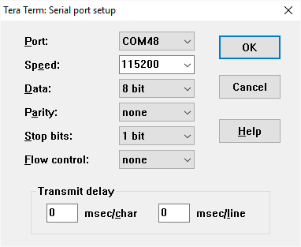
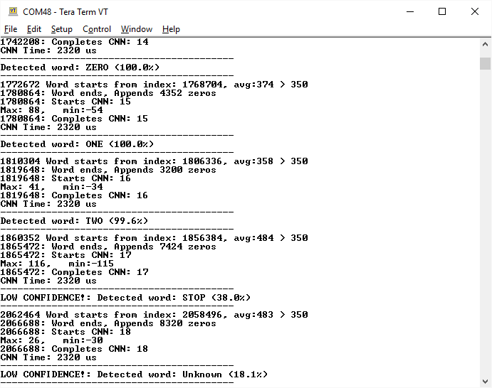

# MAX78002 Keyword Spotting Demo v.3.2

## Overview

The Keyword Spotting Demo software demonstrates recognition of a number of keywords using MAX78002 EVKIT.  

The KWS20 demo software utilizes 2nd version of Google speech commands dataset which consists of 35 keywords and more than 100K utterances:

https://storage.cloud.google.com/download.tensorflow.org/data/speech_commands_v0.02.tar.gz

The following 20 keyword subset from the complete dataset is used for this demo:

 ['**up', 'down', 'left', 'right', 'stop', 'go', 'yes', 'no', 'on', 'off', 'one', 'two', 'three', 'four', 'five', 'six', 'seven', 'eight', 'nine', 'zero**']

Rest of the keywords and unrecognized words fall into "**Unknown**" category.

To improve the unknown detection, the model in version 3.2 is trained with an additional speech dataset from LibriSpeech (http://us.openslr.org/resources/12/dev-clean.tar.gz), segmented to 1-sec audio data and labeled as unknown.


## Software

### Project Usage

Instructions on building, flashing, and debugging MSDK projects can be found in the [MSDK User Guide](https://analog-devices-msdk.github.io/msdk/USERGUIDE/).

### Build Notes

See ["Build System"](https://analog-devices-msdk.github.io/msdk/USERGUIDE/#build-system) in the MSDK User Guide for detailed documentation.  The section below contains additional notes on options that are specific to this project.

This project offers the option to enable or disable the TFT display in [project.mk](project.mk) via the `ENABLE_TFT` build configuration variable.

* Set `ENABLE_TFT = 1` to enable the display, or `ENABLE_TFT = 0` to disable in [project.mk](project.mk).

Additionally, this project also offers the option to switch the display drivers for use with the legacy [Adafruit 3315](https://www.adafruit.com/product/3315) display shipped with some early MAX78002EVKITs.

* Uncomment `TFT = ADAFRUIT` in [project.mk] to use drivers for the legacy [Adafruit 3315](https://www.adafruit.com/product/3315).  Otherwise, the default drivers for the [NewHaven NHD-2.4-240320CF](https://newhavendisplay.com/2-4-inch-premium-spi-resistive-tft-display/) will be used.

## Hardware

### MAX78002 EVKIT Jumper Setting and Microphone

Make sure to install the jumper at JP37 and connect the I2S microphone board as shown below:


### Operation

Following words can be detected:

 ['**up', 'down', 'left', 'right', 'stop', 'go', 'yes', 'no', 'on', 'off', 'one', 'two', 'three', 'four', 'five', 'six', 'seven', 'eight', 'nine', 'zero**']

 The MAX78002 KWS20 demo firmware recognizes keywords and reports result and confidence level.

### Using Debug Terminal

Debug terminal shows more information on status and detected words.

The USB cable connected to CN2 (USB/UART) provides power and serial communication.

To configure PC terminal program select correct COM port and settings as follow:



After turning on power or pressing reset button the following message will appear in terminal window:


Terminal display after detecting words:




The software components of KWS20 demo are shown in diagram below:


## CNN Model

### Synthesis

See the [Analog Devices AI](https://github.com/MaximIntegratedAI) Github repository for full documentation on the AI training and C Code synthesis tools.  This section contains additional information on the specific model used for this project.

The KWS20 v.3 Convolutional Neural Network (CNN) model consists of **1D** CNN with 8 layers and one fully connected layer to recognize keywords from 20 words dictionary used for training.

This model was originally designed for the MAX78000, but synthesized to run on the MAX78002.  See the [cnn.c](cnn.c) file for the exact command used to synthesize the pretrained model.

```python
class AI85KWS20Netv3(nn.Module):
    """
    Compound KWS20 v3 Audio net, all with Conv1Ds
    """

    # num_classes = n keywords + 1 unknown
    def __init__(
            self,
            num_classes=21,
            num_channels=128,
            dimensions=(128, 1),  # pylint: disable=unused-argument
            bias=False,
            **kwargs

    ):
        super().__init__()
        self.drop = nn.Dropout(p=0.2)
        # Time: 128 Feature :128
        self.voice_conv1 = ai8x.FusedConv1dReLU(num_channels, 100, 1, stride=1, padding=0,
                                                bias=bias, **kwargs)
        # T: 128 F: 100
        self.voice_conv2 = ai8x.FusedConv1dReLU(100, 96, 3, stride=1, padding=0,
                                                bias=bias, **kwargs)
        # T: 126 F : 96
        self.voice_conv3 = ai8x.FusedMaxPoolConv1dReLU(96, 64, 3, stride=1, padding=0,
                                                       bias=bias, **kwargs)
        # T: 62 F : 64
        self.voice_conv4 = ai8x.FusedConv1dReLU(64, 48, 3, stride=1, padding=0,
                                                bias=bias, **kwargs)
        # T : 60 F : 48
        self.kws_conv1 = ai8x.FusedMaxPoolConv1dReLU(48, 64, 3, stride=1, padding=0,
                                                     bias=bias, **kwargs)
        # T: 30 F : 64
        self.kws_conv2 = ai8x.FusedConv1dReLU(64, 96, 3, stride=1, padding=0,
                                              bias=bias, **kwargs)
        # T: 28 F : 96
        self.kws_conv3 = ai8x.FusedAvgPoolConv1dReLU(96, 100, 3, stride=1, padding=0,
                                                     bias=bias, **kwargs)
        # T : 14 F: 100
        self.kws_conv4 = ai8x.FusedMaxPoolConv1dReLU(100, 64, 3, stride=1, padding=0,
                                                     bias=bias, **kwargs)
        # T : 7 F: 128
        self.fc = ai8x.Linear(192, num_classes, bias=bias, wide=True, **kwargs)

    def forward(self, x):  # pylint: disable=arguments-differ
        """Forward prop"""
        # Run CNN
        x = self.voice_conv1(x)
        x = self.voice_conv2(x)
        x = self.drop(x)
        x = self.voice_conv3(x)
        x = self.voice_conv4(x)
        x = self.drop(x)
        x = self.kws_conv1(x)
        x = self.kws_conv2(x)
        x = self.drop(x)
        x = self.kws_conv3(x)
        x = self.kws_conv4(x)
        x = x.view(x.size(0), -1)
        x = self.fc(x)

        return x
```

The CNN input is 128x128=16384 8-bit signed speech samples.

### Training

To invoke network training execute the script:

```bash
(ai8x-training) $ ./scripts/train_kws20_v3_ai87.sh
```

If this is the first time, and the dataset does not exist locally, the script will automatically download Google speech commands dataset (1-second keyword .wav files, sampled at 16KHz, 16-bit) into /data/KWS/raw, and process it to make appropriate training, test and validation dataset integrated in /data/KWS/process/dataset.pt. The processing step expands the training dataset by using augmentation techniques like adding white noise, random time shift, and stretch to improve training results. In addition, each 16000 sample word example is padded with zeros to make it 128x128=16384 speech samples. The augmentation process triples the size of dataset and could take 30min to complete.

Details of network training methodology are described in [AI8X Model Training and Quantization](https://github.com/MaximIntegratedAI/ai8x-synthesis/blob/master/README.md)

After training the un-quantized network can be evaluated by executing the script:

```bash
(ai8x-training) $ ./scripts/evaluate_kws20_v3_ai87.sh
```


### Quantization

The CNN weights generated during training need to be quantized:

```bash
(ai8x-synthesis) $ ./scripts/quantize_kws20_v3_ai87.sh
```

Details of quantization are described in [AI8X Model Training and Quantization](https://github.com/MaximIntegratedAI/ai8x-synthesis/blob/master/README.md)

### Network Synthesis

The network synthesis script generates a pass/fail C example code which includes necessary functions to initialize MAX78002 CNN accelerator, to load quantized CNN weights and input samples and to unload classification results. A sample input with the expected result is part of this automatically generated code to verify.  Following script generates all example projects including **kws20_v3**:

```bash
(ai8x-synthesis) $ ./gen-demos-MAX78002.sh
```

The **kws20_v3** bare-bone C code is partially used in KWS20 Demo. In particular, CNN initialization, weights (kernels) and helper functions to load/unload weights and samples are ported from **kws20_v3** to KWS20_Demo.


## KWS20 Demo Functionality

KWS20 demo works in two modes:  Using microphone (real-time), or offline processing:

```c
#define ENABLE_MIC_PROCESSING
```

(defined in [main.c](main.c))

### Microphone Mode

If **ENABLE_MIC_PROCESSING** is defined, the demo will operate in microphone mode.  In this mode, the EVKIT's I2S Mic is initialized to operate at 16KHz 32-bit samples.  In the main loop, the microphone is sampled, filtered (high-pass to remove DC), and stored into a buffer before being sent to the CNN accelerator.  

### Offline Mode

if **ENABLE_MIC_PROCESSING** is _not_ defined, a header file containing pre-defined 16-bit samples (**kws_five.h**) is used as input to the CNN accelerator.  These samples can be generated using the included `VoiceRecorder.py` and `RealtimeAudio.py` utilities to record a wav file and convert it to header file.

```bash
# record 3sec of 16-bit 16KHz sampled wav file 
$ python VoiceRecorder.py -d 3 -o voicefile.wav
# convert to header
$ python RealtimeAudio.py -i voicefile.wav -o voicefile.h
```

### Sending Sound Snippets to serial

To send the snippets to the serial port in binary format, uncomment the following line in [`project.mk`](project.mk).

```make
# If enabled, it sends out the Mic samples used for inference to the serial port
PROJ_CFLAGS+=-DSEND_MIC_OUT_SERIAL
```

A utility (`capture_serial_bin.py`) is provided in the `/Utility` folder to capture the serial snippets and save them as  .wav files:

```bash
$ python capture_serial_bin.py -c COM3 -o out.wav
```

The snippets will be stored with incremental tags.

### KWS20 Demo Firmware Structure

The following figure shows the processing in KWS20 Demo firmware:


Collected samples from mic/file are 18/16 bit signed and are converted to 8 bit signed to feed into CNN. If Microphone mode, a high pass filter is used to filter out the DC level in captured samples. Scaled samples are stored in a circular buffer in chunks of 128 samples (bytes). 

The following parameters in the firmware can be tuned:

```c
#define SAMPLE_SCALE_FACTOR    		4		// multiplies 16-bit samples by this scale factor before converting to 8-bit
#define THRESHOLD_HIGH				350  	// voice detection threshold to find beginning of a keyword
#define THRESHOLD_LOW				100  	// voice detection threshold to find end of a keyword
#define SILENCE_COUNTER_THRESHOLD 	20 		// [>20] number of back to back CHUNK periods with avg < THRESHOLD_LOW to declare the end of a word
#define PREAMBLE_SIZE				30*CHUNK// how many samples before beginning of a keyword to include
#define INFERENCE_THRESHOLD   		49 		// min probability (0-100) to accept an inference
```

(defined in [main.c](main.c))

When the average absolute values of samples during the last 128 samples go above a threshold, the beginning of a word is marked.

The end of a word is signaled when the **SILENCE_COUNTER_THRESHOLD** back-to-back chunks of samples with an average absolute threshold lower than **THRESHOLD_LOW** are observed.

The CNN requires 1sec worth of samples (128*128) to start processing. This window starts at **PREAMBLE_SIZE** samples prior to the beginning of the word, and ends after 16384 samples. If the end of a word is determined earlier, the pAI85Buffer sample buffer is padded with zeros.

The CNN-related API functions are in **cnn.c**. They are used to load weights and data, start CNN, wait for CNN to complete processing, and unload the result.

If a new network is developed and synthesized, the new weight file and related API functions are needed to be ported from the automatically generated kws20 example project. Furthermore, if the input layer or organization of 128x128 sample sets in the trained network is changed, **AddTranspose()** function should be changed to reflect the new sample data arrangement in CNN memory.

### References

https://github.com/MaximIntegratedAI/MaximAI_Documentation
