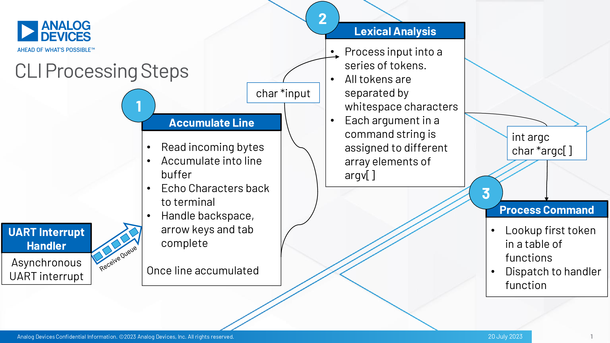

# Command Line Interface

## Description

#### What is a Command Line Interface(CLI)?

A command-line interface or command language interpreter (CLI), also known as command-line user interface, console user interface, and character user interface (CUI), is a means of interacting with an embedded system where the user (or client) issues commands to the program in the form of successive lines of text (command lines).

This library provides an extensible command processor on device to 

* Allows developers to get diagnostics and change device parameters interactively

* Also lend itself to easy automated testing of the device, through PC-side scripting

The current features include the following

- Case insensitive commands & arguments
- Can have spaces at beginning or end of string
- Can have multiple spaces between words
- Backspace
- Arrow keys
- Tab completion


## Software
Point 2 seperate input and output. 
Change the formatting update ADI style guide


(Above:  Describes the steps in which the CLI command processes are being excecuted)

The library is present in the `Libraries/CLI` folder of the MSDK.

### Project Usage

### Enabling the library
Go to project.mk file and include the path to the MAXIM SDK CLI Libaries as this below line

```
include ${MAXIM_PATH}/Libraries/CLI/CLI.mk 
```

## Porting Guide

The CLI library excepts the user to implement the following steps

### Instructions

1. Define an array commands[] of type const command_table_t to contain the name of the command, a function pointer to the corresponding command handler function,
nd the help string which provides a short description of what the command does.

```
const command_table_t commands[] = {{"Mount", handle_mount, "Manually Mount Card"},
									{"Format", handle_format, "Format the Card\n\r"}}
```

3. Define and initialize an integer num_commands to the sizeof your command_table_t structure instance i.e commands divided by the sizeof the structure. Giving the number of commands.
	We will need this to iterate through all the command in your command_table.

```
const int num_commands = sizeof(commands) / sizeof(command_table_t);
```

4. Each handler function must have the same prototype. 

- argc is used to determine which token element of the commands string is being used.
- argv[] is a character array of tokens of the command string entered by the user.

Suppose a user entered the command 
```
mkdir new_folder
```
The Lexical Analysis performed by the CLI library tokenizes mkdir and assigns it to argv[0]. new_folder is assigned to argv[1].

The define command handler function as below.

``` 
void handle_help(int argc, char *argv[])
``` 
Write the functions in user-cli.c and give a function protoype in user-cli.h so it is accessable by the CLI library when it needs to dispatch the handlers

5. You can change the name of your file to something other than user-cli.c/.h but make sure that you also change the headers in [Libraries/CLI/src/cli.h](Libraries/CLI/src/cli.h) to the your newly named header file.


