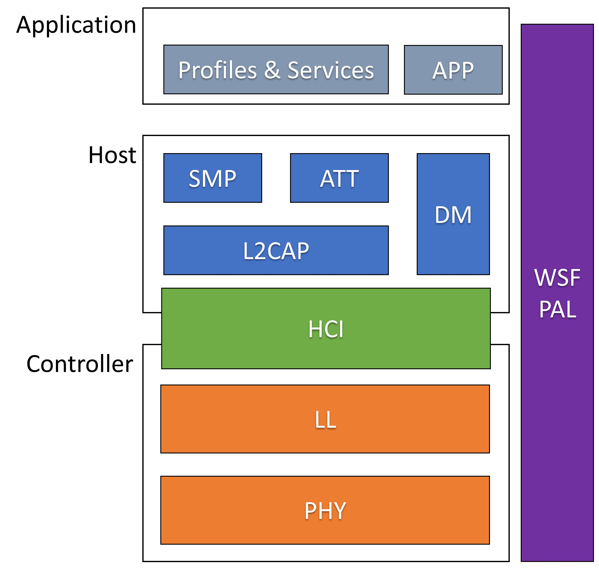
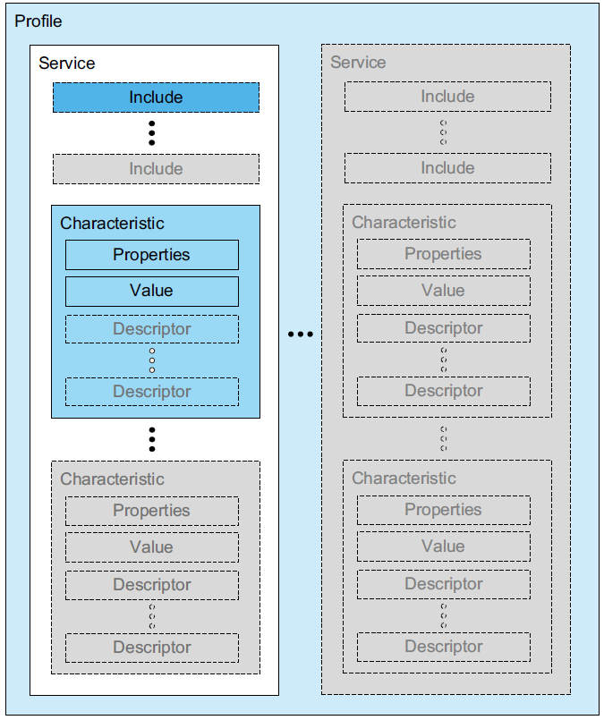
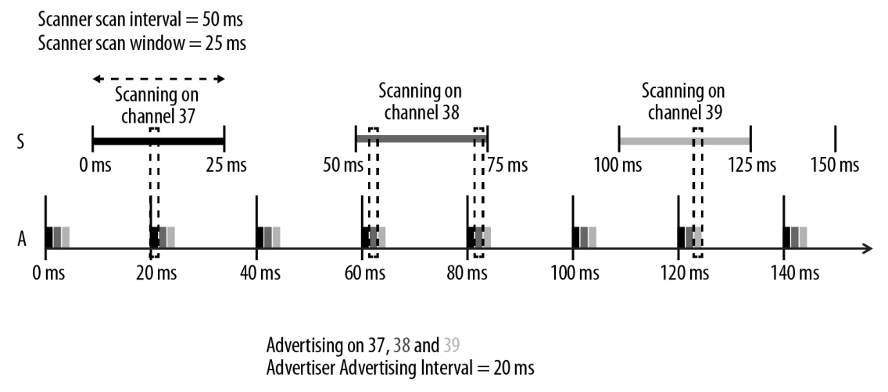
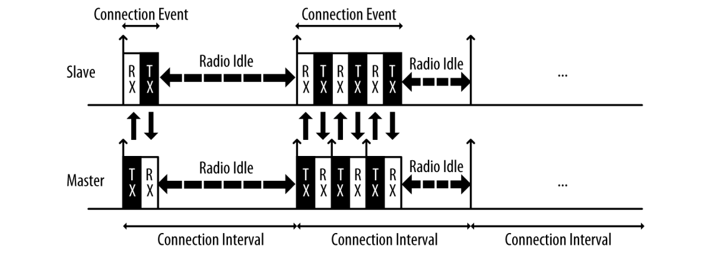

# Cordio BLE User Guide
## Bluetooth LE Basics

### References

The Bluetooth Special Interest Group (SIG) has documentation available on their [website](https://www.bluetooth.com/). Refer to the [documentation](https://www.bluetooth.com/specifications/specs/) page to see the latest core specification. This will be your best resource for learning the details of Bluetooth Low Energy.

These books are also excellent references for developers.

* *Getting Started with Bluetooth Low Energy* by O'Reilly
* *Bluetooth Low Energy: The Developer's Handbook* by Robin Heydon

### Architecture
This section describes the Cordio software architecture. Refer to the Bluetooth specificaion Volume 1, Part A for additional information regarding the Bluetooth architecture.




The Bluetooth stack closely resembles the layers of the network stack. We have the application layer at the top and the physical layer at the bottom. Each layer encapsulates the data and passes it to the appropriate section of the upper and lower layers.


The Host Conroller Interface (HCI) is the common point where devices are split. Typically this this interface is over an asynchronous protocol such as UART. Some devices will define proprietary interfaces between the application and host layers. Multi-core SOCs can also use the HCI or proprietay interfaces to split the stack between multiple CPUs.


When testing the Controller layers, test equipment will have a USB interface and act as a Host device. Devices under test will use a USB to UART adapter and act as Controller devices. 


#### Application

The App Framework performs many operations common to Bluetooth LE embedded applications, such as:

* Application-level device, connection, and security management.
* Simple user interface abstractions for button press handling, sounds, display, and other user feedback.
* An abstracted device database for storing bonding data and other device parameters.

#### Profiles and Services

The GATT Profile specifies the structure in which profile data is exchanged. This structure defines basic elements such as services and characteristics, used in a profile. The top level of the hierarchy is a profile. A profile is composed of one or more services necessary to fulfill a use case. A service is composed of characteristics or references to other services. Each characteristic contains a value and may contain optional information about the value. The service and characteristic and the components of the characteristic (i.e., value and descriptors) contain the profile data and are all stored in Attributes on the server.



#### Wireless Stack Framework

The Wireless Software Foundation (WSF) is a simple OS wrapper, porting layer, and general-purpose software service used by the software system. The goal of WSF is to stay small and lean, supporting only the basic services required by the stack. It consists of the following:

* Event handler service with event and message passing.
* Timer service.
* Queue and buffer management service.
* Portable data types.
* Critical sections and task locking.
* Trace and assert diagnostic services.
* Security interfaces for encryption and random number generation.

#### Platform Adaption Layer

The Platform Adaption Layer is the abstraction between the software stack and the hardware. It includes APIs for timers, UART, RTC, and various system level functions such as sleep and memory management.

See [Libraries/Cordio/platform/Documentation/Cordio-Platform-Documentation.pdf](../platform/Documentation/Cordio-Platform-Documentation.pdf).

#### Attribute Protocol

The ATT subsystem implements the attribute protocol and generic attribute profile (GATT). It contains two independent subsystems: The attribute protocol client (ATTC) and attribute protocol server (ATTS).

ATTC implements all attribute protocol client features and is designed to meet the client requirements of the generic attribute profile. ATTC can support multiple simultaneous connections to different servers.

ATTS implements all attribute protocol server features and has support for multiple simultaneous client connections. ATTS also implements the server features defined by the generic attribute profile.

#### Device Manager

The DM subsystem implements device management procedures required by the stack. These procedures are partitioned by procedure category and device role (master or slave). The following procedures are implemented in DM:

* Advertising and device visibility: Enable/disable advertising, set advertising parameters and data, set connectability and discoverability.
* Scanning and device discovery: Start/stop scanning, set scan parameters, advertising reports, name discovery.
* Connection management: Create/accept/remove connections, set/update connection parameters, read RSSI.
* Security management: Bonding, storage of security parameters, authentication, encryption, authorization, random address management.
* Local device management: Initialization and reset, set local parameters, vendor-specific commands.
DM procedures support the Generic Access Profile (GAP) when applicable.

#### Security Manager Protocol

The Security Manager Protocol (SMP) is the peer-to-peer protocol used to generate encryption keys and identity keys. The protocol operates over a dedicated fixed L2CAP channel. The SMP block also manages storage of the encryption keys and identity keys and is responsible for generating random addresses and resolving random addresses to known device identities. The SMP block interfaces directly with the Controller to provide stored keys used for encryption and authentication during the encryption or pairing procedures.

The SMP subsystem implements the security manager protocol. It contains two independent subsystems:

* The initiator (SMPI). SMPI implements the initiator features of the security manager protocol and has support for multiple simultaneous connections.
* The responder (SMPR). SMPR implements the responder features of the security manager protocol and has support for only one connection (by Bluetooth specification design).

SMP also implements the cryptographic toolbox, which uses AES. The interface to AES is asynchronous and abstracted through WSF. SMP also implements functions to support data signing.

#### Logical Link Control Adaptation Protocol

The L2CAP (Logical Link Control Adaptation Protocol) resource manager block is responsible for managing the ordering of submission of PDU fragments to the baseband and some relative scheduling between channels to ensure that L2CAP channels with QoS commitments are not denied access to the physical channel due to Controller resource exhaustion. This is required because the architectural model does not assume that a Controller has limitless buffering, or that the HCI is a pipe of infinite bandwidth.

L2CAP Resource Managers may also carry out traffic conformance policing to ensure that applications are submitting L2CAP SDUs within the bounds of their negotiated QoS settings. The general Bluetooth data transport model assumes well-behaved applications, and does not define how an implementation is expected to deal with this problem.

#### Host Controller Interface

The HCI subsystem implements the host-controller interface specification. This specification defines commands, events, and data packets sent between a Bluetooth LE protocol stack on a host and a link layer on a controller.
The HCI API is optimized to be a thin interface layer for a single chip system. It is configurable for either a single chip system or traditional system with wired HCI.
This configurability is accomplished through a layered implementation. A core layer can be configured for either a single chip system or wired HCI. A transport and driver layer below the core layer can be configured for different wired transports such as UART.

#### Link Layer

The link layer is responsible for the creation, modification and release of logical links (and, if required, their associated logical transports), as well as the update of parameters related to physical links between devices. The link layer achieves this by communicating with the link layer in remote Bluetooth devices using the  Link Layer Protocol (LL) in LE. The LL protocol allows the creation of new logical links and logical transports between devices when required, as well as the general control of link and transport attributes such as the enabling of encryption on the logical transport, and the adapting of transmit power on the physical link.

#### Physical Layer

The PHY block is responsible for transmitting and receiving packets of information on the physical channel. A control path between the baseband and the PHY block allows the baseband block to control the timing and frequency carrier of the PHY block. The PHY block transforms a stream of data to and from the physical channel and the baseband into required formats.


### States

These are the common states used in Bluetooth LE communication. Typically devices will be in only one of these states at a time, but it is possible for devices to be in all simultaneously. 

#### Advertising

Devices in this state are broadcasting advertisement packets to scanning/initiating devices. This is an asychronous operation that has no synchronization with peer devices. Advertising devices are transmitting without any previous knowledge of peer devices. Advertising and scanning operations are done on channels 37, 38, and 39. The interval between advertising events is configurable between 20 ms and 10.24 s.



#### Scanning / Initiating

Devices in the scanning state listen for advertising devcies and can send scan optionally requests for additional information. The scanning interval and window settings are configurable. 

If a devices is scanning with the intent of connecting to a specific device, that is called the initiating state. The initiating devcies will send a connection indication to the desired advertising device to indicate it's desire to create a connection.

#### Connected

Once a initiating devices sends the connection requset and the advertising devices accepts the connection request, the two devices enter the connected state. This is a point to point connection allowing devcies to directly exchange information. 

In order to minimize interference, devices in the connected state will hop between channels 0-36 in a pseudo random order. The channel hopping information is communicated in the connection indication.

Each connection event is separated by the connection interval. This interval is configurable from 7.5 ms to 4 s. The master will always transmit first and receive second. The Slave will always receive first and transmit second. Devices will typically always send and receive at least one packet in each interval, and they can optionally transmit and receive multiple packets in each interval. 



## Packetcraft Protocol Software

Packetcraft protocol software is a collection of embedded stacks implementing the Bluetooth Low Energy Link Layer, Host, Profile and Mesh specification (www.bluetooth.org).

This repository contains open source release of Packetcraft's software. This is a qualified release and may be used in products. Please consult the [Bluetooth Qualification Process](https://www.bluetooth.com/develop-with-bluetooth/qualification-listing) for further details regarding additional certification requirements.

Release notes
-------------

This latest release of the Packetcraft Host and Packetcraft Controller is Bluetooth 5.2 qualified and implements the following new Bluetooth 5.2 features: LE Isochronous Channels, Enhanced Attribute Protocol, and LE Power Control.

This release includes the following completed requirements for r20.05:

    FW-3340 Isochronous Demo: single BIS data stream
    FW-3354 TCRL.2019-1 compliant
    FW-3359 Core v5.2: LE Isochronous Channels (ISO)
    FW-3360 Core v5.2: LE Power Control
    FW-3361 Core v5.2: Enhanced ATT (EATT)
    FW-3617 Core v5.2: Isochronous Abstraction Layer (ISOAL)
    FW-3726 Core v5.2: Host Support for LE Isochronous Channels (ISO)
    FW-3727 Nordic nRF5 SDK 16.0.0
    FW-3730 Compile BLE host for 64-bit platform
    FW-3736 Light CTL Model
    FW-3738 Mesh v1.0.1 compliant
    FW-3739 TCRL.2019-2 qualification
    FW-3750 Laird BL654 platform
    FW-3767 SBC codec
    FW-3803 GCC compiler support for gcc-arm-none-eabi-9-2019-q4-major
    FW-3820 Protect against SweynTooth vulnerability


Getting Started
---------------

**1. Toolchain**

If using a system with package manager such as Ubuntu, use the following command line to install dependent tools:

```
sudo apt-get install build-essential binutils-arm-none-eabi
```

Alternatively download and install the GNU Arm Embedded Toolchain from here and add the path to the `bin` folder to your PATH environment.

* [GNU Arm Embedded Toolchain](https://developer.arm.com/tools-and-software/open-source-software/developer-tools/gnu-toolchain/gnu-rm)


**2. Build**

Select a project to build. The following folders contains buildable projects:

* Packetcraft Profile sample application: [ble-apps/build](../ble-apps/build)
* Packetcraft Mesh sample application: [ble-mesh-apps/build](../ble-mesh-apps/build)
* Packetcraft Controller sample application: [controller/build](../controller/build)

Consult the Sample App Developer's Guide (below) for more information about the application usage.

For example, to build Packetcraft's sample Bluetooth Low Energy Tag device use the following make command from the root repo folder:

```
make -C ble-apps/build/tag/gcc
```

This command will build a complete device image including the Tag sample application, Profiles, Host, Link Layer and platform drivers for the Nordic nRF52840 / PCA10056 development board. The resulting image is located at `ble-apps/build/tag/gcc/bin/tag.bin`.


**3. Program**

To install the firmware image on a Nordic PCA10056 developmnent board, plug a USB cable into your PCA10056. Drag-n-Drop the resulting image from the previous step onto the mass storage drive called "JLINK".


Documentation
-------------

See the docs directory.


Certification
-------------

Bluetooth LE Mesh solution implementing of the Bluetooth Mesh Profile 1.0 and the Bluetooth Mesh Model 1.0 wireless technical specifications

* [QDID 116593](https://launchstudio.bluetooth.com/ListingDetails/66212)

Bluetooth LE Host protocol stack implementing Bluetooth Core 5.2 specification

* [QDID 146344](https://launchstudio.bluetooth.com/ListingDetails/103670)

Bluetooth LE Link Layer protocol stack implementing Bluetooth 5.2 specification

* [QDID 146281](https://launchstudio.bluetooth.com/ListingDetails/103599)


Verification
------------

Packetcraft Mesh is verified with the TCRL.2019-2 compliance tester using the following:

* Bluetooth Profile Tuning Suites 7.6.1

Packetcraft Host is verified with the TCRL.2019-2 compliance tester using the following:

* Bluetooth Profile Tuning Suites 7.6.1

Packetcraft Profiles is verified with the TCRL.2018-2 compliance tester using the following:

* Bluetooth Profile Tuning Suites 7.3.0

Packetcraft Link Layer conforms to the Bluetooth TCRL.2019-2 requirements verified with the following:

* Teledyne Harmony LE Tester version 19.12.16916.21195

This product was compiled and tested with the following version of GNU GCC

* gcc-arm-none-eabi-9-2019-q4-major


Platforms
---------

This release was tested on the following platforms. Note: platforms listed may not be available in this repository.

* Nordic nRF52840 / PCA10056 development kit / Nordic nRF5 SDK 16.0.0 (make configuration: "PLATFORM=nordic BOARD=PCA10056")
* Nordic nRF52832 / PCA10040 development kit / Nordic nRF5 SDK 16.0.0 (make configuration: "PLATFORM=nordic BOARD=PCA10040")
* Laird BL654 / 451-00004 USB adapter / Nordic nRF5 SDK 16.0.0 (make configuration: "PLATFORM=laird")

## Applications
* [BLE4](Applications/BLE4_ctr.md)
* [BlLE5](Applications/BLE5_ctr.md)
* [FreeRTOS](Applications/BLE_FreeRTOS.md)
* [DAT Client/Server](Applications/BLE_datc_dats.md)
* [BLE FCC](Applications/BLE_fcc.md)
* [BLE Fit](Applications/BLE_fit.md)
* [BLE MCS](Applications/BLE_mcs.md)
* [OTA Client/Server](Applications/BLE_otac_otas.md)
* [BLE Periph](Applications/BLE_periph.md)
* [Bootloader](Applications/Bootloader.md)
* [RF Test](Applications/RF_Test.md)
